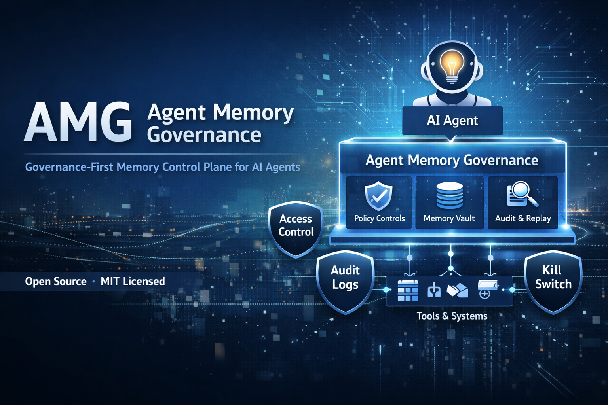

<p align="center">
  
</p>

# Agent Memory Governance (AMG) 

<!-- Project Status & Quality -->
[](https://github.com/ugenkudupudiqbnox/AMG/actions/workflows/ci.yml)
[](LICENSE)
[](#project-status)
<!-- Governance & Security -->
[](SECURITY.md)
[](GOVERNANCE_MODEL.md)
<!-- Community -->
[](https://discord.gg/qPmpZdNYAC)

> Governance before intelligence. Control before autonomy.

**A governance-first memory control plane for AI agents.**

Built for auditability, compliance, and deterministic behavior.

**AMG** provides a deterministic, enterprise-grade memory governance layer for agents — unlike in-model memory storage or ungoverned vector silos

**Status:** Early / V1 (Foundational)

---

## 📚 Documentation

**Complete documentation is available in [docs/](./docs/INDEX.md)**

**Quick Links:**
- **[Architecture](./docs/architecture/)** - System design and implementation
- **[Governance](./docs/governance/)** - Policy definitions and threat model
- **[Deployment](./docs/deployment/)** - Infrastructure setup guides
- **[Dashboards](./docs/dashboards/)** - Grafana monitoring and KPIs
- **[User Guides](./docs/guides/)** - Operator documentation

---

## 📁 Project Structure

```
AMG/
├── README.md                          # This file
├── CONTRIBUTING.md                    # Contribution guidelines
├── SECURITY.md                        # Security policy
├── CODE_OF_CONDUCT.md                 # Community standards
├── pyproject.toml                     # Python project config
├── requirements.txt                   # Python dependencies
├── run_api.py                         # AMG API server
│
├── src/                               # Source code
│   └── amg/                           # Main package
│       ├── adapters/                  # Storage & framework adapters
│       ├── api/                       # HTTP API endpoints
│       └── ...                        # Core modules
│
├── tests/                             # Test suite
│
├── docs/                              # Complete documentation
│   ├── INDEX.md                       # Documentation hub
│   ├── architecture/                  # System design
│   ├── governance/                    # Policies & governance
│   ├── deployment/                    # Infrastructure guides
│   ├── dashboards/                    # Grafana setup
│   ├── guides/                        # Operator documentation
│   └── phases/                        # Historical phases
│
├── scripts/                           # Automation scripts
│   ├── amg-api.service              # Systemd service file
│   ├── setup-amg-grafana.sh           # Unified AMG + Grafana setup
│   ├── setup-https.sh                # HTTPS setup script
│   └── setup-grafana.sh              # Grafana setup script
│
└── config/                            # Configuration files
    ├── amg-api-https.conf            # Nginx HTTPS config
    └── grafana/
        └── dashboards/
            └── amg-overview.json    # Pre-built Grafana dashboard
```

---

## 🚀 Quick Start

### 1. Unified Setup (Recommended)
Set up both AMG and Grafana with a single command:
```bash
sudo ./scripts/setup-amg-grafana.sh
```
This script automatically:
- Installs AMG API and systemd service
- Installs Grafana (via Docker)
- Configures Nginx reverse proxy and SSL
- Provisions the AMG API data source and pre-built monitoring dashboards

### 2. Manual Getting Started
1. **Read**: [README.md](./README.md) (this file)
2. **Learn**: [docs/INDEX.md](./docs/INDEX.md) - Full documentation hub
3. **Deploy**: [docs/deployment/](./docs/deployment/) - Setup guides
4. **Monitor**: [docs/dashboards/](./docs/dashboards/) - Grafana setup

### File Locations
- **Setup Scripts**: `scripts/` - Run deployment automation
- **Configuration**: `config/` - Nginx and deployment configs
- **Documentation**: `docs/` - Organized by purpose

---

## Why This Project Exists

AI agents are no longer simple chatbots.

They:

* persist memory across interactions
* use tools and external systems
* act semi-autonomously
* operate inside enterprise environments

Yet most agent stacks today treat **memory as an ungoverned implementation detail**.

This creates serious problems:

* data retention violations
* unexplainable agent behavior
* failed SOC 2 / ISO audits
* inability to stop or replay agent actions

**Agent Memory Governance (AMG)** exists to solve this exact gap.

---

## What AMG Is

AMG is **not** an agent framework.

It is part of the **agentic canvas** — the foundational infrastructure that governs:

* what an agent can remember
* what context it can see
* how that context is constructed
* how actions are audited
* how agents are stopped

This aligns with the concept of *agentic canvas* and *context engineering* described in *Agentic Design Patterns* .

---

## What AMG Is Not

AMG does **not**:

* improve reasoning
* perform planning
* learn or adapt
* coordinate multi-agent behavior
* replace LangChain, LangGraph, CrewAI, etc.

AMG deliberately stays **below** intelligence and **above** storage.

---

## Core Principles

AMG is built on six non-negotiable principles:

1. **Memory is a regulated data asset**
2. **Governance precedes intelligence**
3. **Context must be curated, not accumulated**
4. **All controls live outside the LLM**
5. **Every agent action must be explainable**
6. **Agents must be stoppable instantly**

These principles reflect best practices from guardrail and safety patterns in agentic systems .

---

## Conceptual Architecture

```
┌──────────────┐
│  Agent / LLM │   ← reasoning (untrusted)
└──────┬───────┘
       │
┌──────▼───────┐
│      AMG     │   ← governance, memory, context
└──────┬───────┘
       │
┌──────▼───────┐
│ Tools / APIs │
└──────────────┘
```

AMG **wraps** agents.
Agents never bypass AMG to access memory or tools directly.

---

## Memory Model (The Core Abstraction)

AMG treats memory as a **governed contract**, not a blob.

Every memory item has:

| Attribute   | Meaning                           |
| ----------- | --------------------------------- |
| Type        | Short-term / Long-term / Episodic |
| Scope       | Agent / tenant                    |
| Provenance  | Source event                      |
| TTL         | Retention duration                |
| Sensitivity | PII / non-PII                     |
| Usage       | Read constraints                  |

This formalizes *what the agent knows, when it knows it, and how it is allowed to use it* — the foundation of disciplined context engineering .

---

## Memory Types (V1)

| Type           | Rules                                |
| -------------- | ------------------------------------ |
| **Short-term** | Request-scoped only, never persisted |
| **Long-term**  | TTL required                         |
| **Episodic**   | TTL + decay eligible                 |

No custom schemas in V1.
Opinionated by design.

---

## Governed Context Builder

Agents **do not query memory directly**.

All context is built through AMG, which enforces:

* agent identity & role checks
* memory-type filtering
* TTL enforcement
* sensitivity filtering
* token budget limits

This ensures agents receive **short, focused, policy-compliant context**, a key requirement for reliable agentic systems .

---

## Audit & Replay

Every request produces an immutable trace:

* request ID
* agent ID
* prompt hash
* memory IDs used
* policy decisions
* output hash
* timestamp

This enables:

* post-incident analysis
* reflection workflows
* compliance audits
* deterministic replay

AMG enables reflection infrastructure — it does not perform learning.

---

## Kill Switch & Incident Controls

AMG provides mandatory enterprise controls:

* disable an agent
* freeze memory writes
* switch to read-only mode
* global shutdown

Accessible via API and CLI.

If an agent cannot be stopped, it should not exist.

---

## Supported Agentic Patterns (Indirect)

AMG does not implement agentic patterns — it **enables them safely**.

| Pattern           | How AMG Helps              |
| ----------------- | -------------------------- |
| Prompt chaining   | Deterministic memory scope |
| Routing           | Context filters per route  |
| Tool use          | Proxy + audit              |
| Reflection        | Replay logs                |
| Human-in-the-loop | Memory freeze & disable    |
| Evaluation        | Audit logs as ground truth |

This keeps AMG firmly in the **infrastructure layer**, not the intelligence layer .

---

## APIs (V1 – Minimal)

```http
POST /memory/write
POST /memory/query
POST /context/build
GET  /audit/{request_id}
POST /agent/disable
```

No SDK lock-in.
LLM-agnostic by design.

---

## Compliance Orientation

AMG is designed to map cleanly to:

* SOC 2 (CC1, CC6, CC7, CC8, CC9)
* ISO 27001 (A.5, A.8, A.9, A.12, A.18)
* GDPR / DPDP (right to forget, minimization)

Memory governance is treated as **enterprise data governance**, not application state.

---

## What V1 Deliberately Does Not Do

* multi-agent memory sharing
* learning or adaptation
* graph reasoning
* dashboards or UIs
* auto PII detection

These are intentional exclusions to preserve auditability and trust.

---

## Project Status

AMG is in **early development**.

V1 focuses on:

* correctness
* determinism
* governance
* trust

Not demos.
Not hype.

---

## Who Should Use This

* Enterprise AI platform teams
* Security & compliance teams
* OSS developers building serious agents
* Researchers interested in governed agentic canvases

---

## Contributing

We welcome:

* storage adapters
* agent framework adapters
* policy extensions
* documentation improvements

Please see:

* `CONTRIBUTING.md`
* `SECURITY.md`
* `CODE_OF_CONDUCT.md`

Governance of the project is intentionally conservative.

---

## Philosophy (In One Sentence)

> **Intelligence impresses demos.
> Governance enables deployment.**
